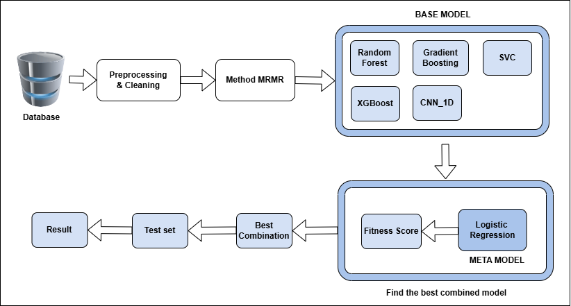

# Phân loại Rối loạn nhịp tim sử dụng GA Stacking trong Mô hình kết hợp (Ensemble Learning)

## 🇻🇳 Tiếng Việt

**Môn học:** DS106 - Tối ưu hóa và Ứng dụng (Optimization and Application)

### Giới thiệu Dự án

Dự án này tập trung vào việc ứng dụng các kỹ thuật Học máy hiện đại để giải quyết bài toán chẩn đoán quan trọng trong y tế: **Phân loại Rối loạn nhịp tim (Cardiac Arrhythmia)**. Việc phân loại chính xác nhịp tim từ dữ liệu điện tâm đồ (ECG) là bước thiết yếu để đưa ra quyết định điều trị kịp thời.

### Mục tiêu và Phương pháp luận

Mục tiêu chính của nhóm là xây dựng một mô hình lai (hybrid model) có khả năng phân loại các loại rối loạn nhịp tim với độ chính xác và độ tin cậy cao, đặc biệt trong điều kiện dữ liệu y tế thường xuyên bị mất cân bằng.

Chúng tôi đã triển khai kỹ thuật học hợp thể **Stacking (Stacking Ensemble Learning)**. Mô hình này bao gồm:

1.  **Các Mô hình Cơ sở (Base Models):** Một tập hợp đa dạng gồm 5 mô hình khác nhau (như Random Forest, XGBoost, Support Vector Classifier, và Convolutional Neural Network - CNN) được sử dụng để trích xuất các đặc trưng và đưa ra dự đoán ban đầu.
2.  **Mô hình Meta (Meta-Model):** Mô hình Logistic Regression được sử dụng để học cách kết hợp tối ưu các dự đoán từ các mô hình cơ sở.

Để tối ưu hóa hiệu suất của mô hình hợp thể, chúng tôi áp dụng **Thuật toán Di truyền (Genetic Algorithm - GA)** và kỹ thuật Grid Search. GA giúp tìm kiếm bộ siêu tham số và cấu trúc mô hình tối ưu một cách hiệu quả, đặc biệt trong không gian tham số phức tạp.

### Kết quả Đạt được

Các mô hình Stacking Ensemble, được tối ưu hóa bằng GA, đã cho thấy kết quả đầy hứa hẹn.

* **Độ chính xác (Accuracy) đạt trên 0.70**.
* Các chỉ số đánh giá quan trọng khác như **Precision, Recall, và F1-score** đều được cải thiện đáng kể so với các mô hình đơn lẻ.
* Mô hình thể hiện khả năng vượt trội trong việc xử lý thách thức của **dữ liệu mất cân bằng**, giúp tăng cường độ nhạy bén trong việc phát hiện các loại rối loạn nhịp tim ít phổ biến hơn.

***

# Classification of Cardiac Arrhythmia Using GA Stacking in Ensemble Learning

## 🇬🇧 English Version

**Course:** DS106 - Optimization and Application

### Project Introduction

This project focuses on applying modern Machine Learning techniques to address a critical diagnostic problem in healthcare: **Classification of Cardiac Arrhythmia**. Accurate classification of heart rhythms from Electrocardiogram (ECG) data is an essential step for timely treatment decisions.

### Objectives and Methodology

The primary goal of the team was to build a robust hybrid model capable of classifying various types of arrhythmia with high accuracy and reliability, particularly under the common constraint of imbalanced medical data.

We implemented the **Stacking Ensemble Learning** technique. This model consists of:

1.  **Base Models:** A diverse set of five different models (including Random Forest, XGBoost, Support Vector Classifier, and a Convolutional Neural Network - CNN) used to extract features and provide initial predictions.
2.  **Meta-Model:** A Logistic Regression model employed to optimally combine the predictions from the base models.

To optimize the ensemble model's performance, we applied the **Genetic Algorithm (GA)** alongside Grid Search. GA effectively helps search for the optimal set of hyperparameters and model structure, especially in complex parameter spaces.

### Achieved Results

The GA-optimized Stacking Ensemble models demonstrated promising results.

* **Accuracy achieved was above 0.70**.
* Other critical evaluation metrics such as **Precision, Recall, and F1-score** were significantly improved compared to individual models.
* The model exhibited superior capability in handling the challenge of **imbalanced data**, thereby enhancing the sensitivity in detecting less common types of arrhythmia.
